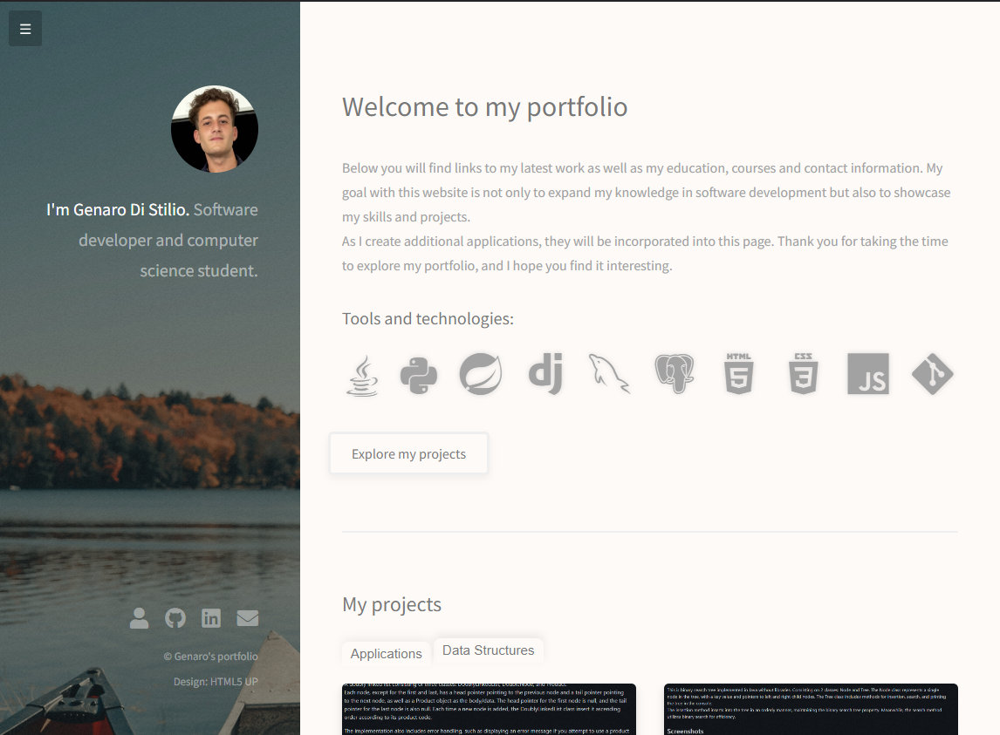

# Web Portfolio
Web Portfolio is a dynamic, lightweight, and personalized web application based on the Django framework that showcases your projects and skills. This project, a modification of the Strata template by HTML5 UP, leverages the power of Django to create a customizable, data-driven portfolio page. Visitors can see my projects, skills, certificates, and other details to the application, which are then dynamically rendered on the portfolio page.  

<h1>Screenshots</h1>

About me tab:

  
Education & certifications tab:

## Changes from Original Template
* Multiple Tab Project Showcase: Added x separate tabs for showcasing different categories of projects, offering a more organized view of the portfolio.  
* Certificate Scrolling: Added a scrolling functionality for certificates.  
* Smooth Navigation: Implemented smooth navigation and transitions for a seamless user experience.  
* Clipboard Functionality: Added functionality to copy email and other contact information directly to the clipboard.  
* Dropdown Menu: Added a dropdown menu for better navigation.  
* Contact Me Feature: Implemented a functional anti-spam email sender in the "Contact Me" section for secure and reliable communication.  
* Education and Courses cards: Created card layouts to display educational qualifications and courses.

## Contributing
Pull requests are welcome. For major changes, please open an issue first to discuss what you would like to change.

## License
This project is licensed under the Creative Commons Attribution 3.0 Unported License (CC BY 3.0), which allows for both personal and commercial use. Please see the LICENSE file for more details. The modifications to the original Strata template by HTML5 UP are made available under the same license.  
Original template: Strata by HTML5 UP, free for personal and commercial use under the CCA 3.0 license.

